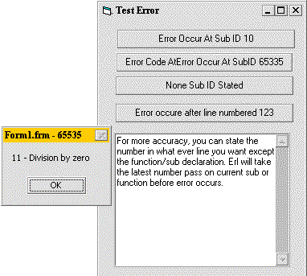



## Erl

### Description

Checking Where Errors Occurs
 
### More Info
 

not so many vb programmer realize the existance of Erl (error line) and some of them who used it alway get the value of 0.

here is an example, (makes me remember my old gwbasic). you can put the line number at the beginning of visual basic code, but not the function/sub header.

eg.

'~~~~~~~~~~~~~~~~~~~~~~~~~~~~~~~~~~~

Const strModuleName = "Form1.frm" '//module or form or class

Private Sub myButtonClick()

On Error Goto errClick

12345 '//NOTICE, THIS IS THE LINE NUMBER,

'// YOU CAN PUT WHATEVER NUMBER FORM UP TO 65535(max)

Dim intX as Integer

'//GENERATING RUNTIME ERROR

intX = 12 \ 0 'Division by Zero

Exit Sub

errClick:

'//Show what line number does Erl recently passed before error

'occurs

MsgBox Err.Number & " - " & Err.Decription, , _

strModuleName & " - " &Erl

End Sub

This will pop up a message box "11 - Division by Zero" with title Form1.frm - 12345.

Numbering every code line is tedious thing to do, some suggestion, just put UNIQUE number ID(plus some constant of your module/form/class Name) at the beginning of you critical function (function which error is likely to happen). so when error comes, you will know which function it came from

             |
---                |---
**Submitted On**   |2000-12-03 02:11:38
**By**             |[khairil anwar yusoff](https://github.com/Planet-Source-Code/PSCIndex/blob/master/ByAuthor/khairil-anwar-yusoff.md)
**Level**          |Beginner
**User Rating**    |4.8 (19 globes from 4 users)
**Compatibility**  |VB 5\.0, VB 6\.0
**Category**       |[Debugging and Error Handling](https://github.com/Planet-Source-Code/PSCIndex/blob/master/ByCategory/debugging-and-error-handling__1-26.md)
**World**          |[Visual Basic](https://github.com/Planet-Source-Code/PSCIndex/blob/master/ByWorld/visual-basic.md)
**Archive File**   |[CODE\_UPLOAD122661222000\.zip](https://github.com/Planet-Source-Code/khairil-anwar-yusoff-erl__1-13268/archive/master.zip)

